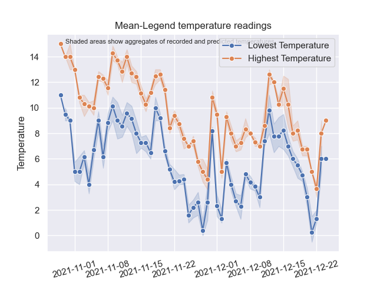
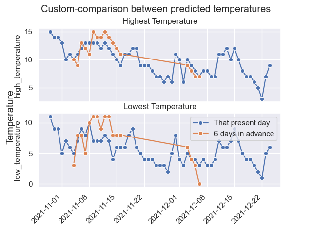

# variability-in-temperature-forecast
The objective for this project looks into generating a weather report database, and functins alongisde an application which visualizes its data into meaningful insight regarding weather forecasts.

Currently, it relies on a few lines of code ran at console level. This requires basic to no knowledge of coding, but expects a python software or an IDE to operate. This would be available as an application that would be ran at desktop user-interface level, with options that can automate daily data gathering tasks and one-click visualization icons.

In the future, this app would move towards informing weather for iteneraries. Using past past data to predict weather for temporal geo-locations - with hopes it could be the 'weather-proof' partner in the future and replace the slightly less effective human intuition. 

